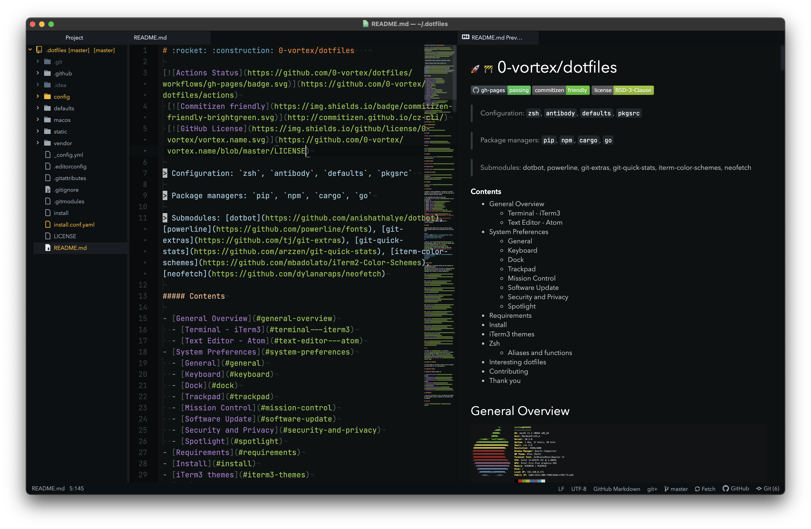

# :rocket: :construction: 0-vortex/dotfiles   

[](https://github.com/0-vortex/dotfiles/actions/workflows/docs.yml)
 [](http://commitizen.github.io/cz-cli/)
 [](https://github.com/0-vortex/vortex.name/blob/master/LICENSE)

> Configuration: zsh, antibody, defaults, pkgsrc 

> Package managers: pip, npm, cargo, go

> Submodules: [dotbot](https://github.com/anishathalye/dotbot), [powerline](https://github.com/powerline/fonts), [git-extras](https://github.com/tj/git-extras), [git-quick-stats](https://github.com/arzzen/git-quick-stats), [iterm-color-schemes](https://github.com/mbadolato/iTerm2-Color-Schemes), [neofetch](https://github.com/dylanaraps/neofetch)

##### Contents

- [General Overview](#general-overview)
  - [Terminal - iTerm3](#terminal---iterm3)
  - [Text Editor - Atom](#text-editor---atom)
- [System Preferences](#system-preferences)
  - [General](#general)
  - [Keyboard](#keyboard)
  - [Dock](#dock)
  - [Trackpad](#trackpad)
  - [Mission Control](#mission-control)
  - [Software Update](#software-update)
  - [Security and Privacy](#security-and-privacy)
  - [Spotlight](#spotlight)
- [Requirements](#requirements)
- [Install](#install)
- [iTerm3 themes](#iterm3-themes)
- [Zsh](#zsh)
  - [Aliases and functions](#aliases-and-functions)
- [Interesting dotfiles](#interesting-dotfiles)
- [Contributing](#contributing)
- [Thank you](#thank-you)

## General Overview

[](https://asciinema.org/a/zZEvW8UodkvLzjsSQLYgaLW0P)

### Terminal - iTerm3


### Text Editor - Atom



## System Preferences


### General


### Keyboard


### Dock


### Trackpad


### Mission Control


### Software Update


### Security and Privacy


### Spotlight


## Requirements

I describe my custom configuration I use below. It is heavily tailored to my own workflow so it is best you take ideas from it rather than copying the entire config.

1. Boot fresh/user macOS Mojave or above copy.
1. Go through [system preferences](#system-preferences) and set everything up.
1. Install [Xcode](https://developer.apple.com/xcode/).
1. Install [GPG Suite](https://gpgtools.org).
1. Install [KeyBase](https://keybase.io).
1. Install [Python](https://www.python.org).
1. Install [Node.js](https://nodejs.org/en/).
1. Install [Go](https://golang.org/dl/).
1. Install [Rust](https://www.rust-lang.org/) via 
``curl --proto '=https' --tlsv1.2 -sSf https://sh.rustup.rs | sh``
8. Install [Antibody](http://getantibody.github.io/) via 
``sudo sh -s -c "$(curl -sfL git.io/antibody)" - -b /usr/local/bin``.
9. Install [Atom](http://atom.io) and ``CMD+SHIFT+P`` to 
``Window: Install shell commands``.
10. Download dotfiles repository recursively and [install](#install).

## Install

Optionally import Keybase gpg key into gpg tools for signed commits (replace keyname with the returned key from list secret keys)

```bash
keybase pgp export --secret | gpg --allow-secret-key --import
gpg --list-secret-keys --keyid-format LONG
gpg --armor --export keyname | pbcopy
```

I also use [DotBot](https://github.com/anishathalye/dotbot) to apply appropriate symlinks so that I can keep the original files in this one dotfiles dir. Look [here](https://raw.githubusercontent.com/0-vortex/dotfiles/master/install.conf.yaml) for what it will exactly do. Place this cloned dotfiles repo in `~/.dotfiles/` and run `./install` inside it.

```bash
git clone --recurse-submodules -j4  git@github.com:0-vortex/dotfiles.git .dotfiles
cd .dotfiles
./install
```

## iTerm3 themes

My top 3 themes I am switching between are: ayu, Spacedust and LiquidCarbonTransparent.
Head over to [mbadolato/iTerm2-Color-Schemes](https://github.com/mbadolato/iTerm2-Color-Schemes) and pick your favorites. My handpicked list of themes I am keeping installed is:

#### [Atom](https://github.com/mbadolato/iTerm2-Color-Schemes/tree/master/schemes/Atom.itermcolors)


#### [Flatland](https://github.com/mbadolato/iTerm2-Color-Schemes/tree/master/schemes/Flatland.itermcolors)


#### [Glacier](https://github.com/mbadolato/iTerm2-Color-Schemes/tree/master/schemes/Glacier.itermcolors)


#### [LiquidCarbonTransparent](https://github.com/mbadolato/iTerm2-Color-Schemes/tree/master/schemes/LiquidCarbonTransparent.itermcolors)


#### [Monokai Vivid](https://github.com/mbadolato/iTerm2-Color-Schemes/tree/master/schemes/Monokai%20Vivid.itermcolors)


#### [PaulMillr](https://github.com/mbadolato/iTerm2-Color-Schemes/tree/master/schemes/PaulMillr.itermcolors)


#### [SeaShells](https://github.com/mbadolato/iTerm2-Color-Schemes/tree/master/schemes/SeaShells.itermcolors)


#### [Spacedust](https://github.com/mbadolato/iTerm2-Color-Schemes/tree/master/schemes/Spacedust.itermcolors)


#### [Tomorrow Night Bright](https://github.com/mbadolato/iTerm2-Color-Schemes/blob/master/schemes/Tomorrow%20Night%20Bright.itermcolors)


#### [ayu](https://github.com/mbadolato/iTerm2-Color-Schemes/tree/master/schemes/ayu.itermcolors)


## Zsh

I am using [Zsh](http://www.zsh.org) as my shell and [Antibody](https://github.com/getantibody/antibody) to install all my Zsh plugins. For terminal I use [iTerm3](https://www.iterm2.com) with [ayu](https://raw.githubusercontent.com/mbadolato/iTerm2-Color-Schemes/master/schemes/ayu.itermcolors) color scheme and [12pt JetBrains Mono](https://www.jetbrains.com/lp/mono/) font.

### Aliases and functions

I use some aliases to get around my system as fast as possible. You can view them all [here](zsh/alias.zsh).

## Interesting dotfiles

My dotfiles are heavily inspired by:

- [mathiasbynens/dotfiles](https://github.com/mathiasbynens/dotfiles)
- [paulirish/dotfiles](https://github.com/paulirish/dotfiles)
- [lee-dohm/dotfiles](https://github.com/lee-dohm/dotfiles)
- [nikitavoloboev/dotfiles](https://github.com/nikitavoloboev/dotfiles)
- [rix1/dotfiles](https://github.com/rix1/dotfiles)
- [wilsonmar/dotfiles](https://wilsonmar.github.io/dotfiles/#launchpad-dashboard)
- [tiiiecherle/osx_install_config](https://github.com/tiiiecherle/osx_install_config#default-shell-and-config-file)
- [audibleblink/dotbot](https://github.com/audibleblink/dotbot)

## Contributing

[Suggestions](../../issues/) on how I can improve the structure of these dotfiles as well as suggesting new and awesome tools are welcome.

## Thank you

[](https://twitter.com/0_vortex)
